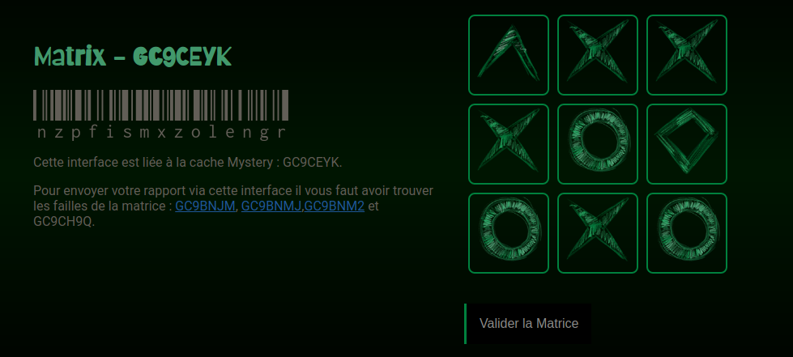

# Géocaching : cache bonus Matrice (front-end)

## Il était une fois... 

Je suis passionnée par les énigmes et les jeux en tout genre : il était donc évident que je me passionne pour le géocaching et que je pose aussi des caches. Si vous ne connaissez pas le concept, n'hésitez pas à faire un tour ici sur le [site officiel](https://www.geocaching.com/play).

L'une des caches que j'ai cachées à Bordeaux nécessite de résoudre une énigme dont la réponse est à fournir sur ce site que j'ai développé. Vous pouvez consulter la fiche de cette cache sur [geocaching.com](https://www.geocaching.com/geocache/GC9CEYK)

## Concrètement, que fait ce jeu ? 

Le front de ce jeu renvoie au back une réponse en fonction des formes sélectionnées dans la matrice. 

Si la réponse est juste, le back renvoie au front les coordonnées GPS qui indiquent l'emplacement de la dernière cache à trouver. Ces coordonnées sont affichées sous le code barre. 

Vous pouvez tester le jeu hébergé sur [mon site](https://matrice.alexandrabercoff.com/). Pour valider la (fausse) bonne réponse, remplissez la matrice de "triangles". 

## Stack Technique (prérequis)

 


Git : https://git-scm.com/downloads

NodeJS (v12 ou supérieure) : https://nodejs.org/en/download/

## Comment l'utiliser ? 

1. Télécharger le repo sur votre machine

```bash
git clone <url du repo>
```

2. Installez les dépendances

```bash
npm install 
```
3. Exécuter `react-scripts start` pour lancer l'application. 

Le repo du back se trouve sur github : [gc_matrice_bonus_back](https://github.com/Alekiel42/gc_matrice_bonus_back). 


### L'information qui transite

Chaque forme possèdre une correspondance en chiffre qu'il faut garder en tête pour personnaliser la bonne réponse dans le back-end. 

| Forme    | Chiffre |
| -------- | ------- |
| vide     | 0       |
| triangle | 1       |
| losange  | 2       |
| croix    | 3       |
| cercle   | 4       |

